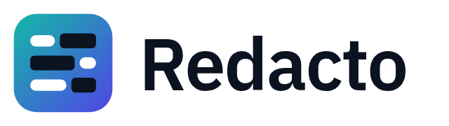

<picture>
  <source media="(prefers-color-scheme: dark)" srcset="docs/assets/redacto-logo-white.png">
  
</picture>

# Redacto

Redacto is a Manifest V3 Chrome extension that detects personally identifiable information (PII) before text is pasted into supported LLM chat apps. Detection runs **entirely on your device**: deterministic recognizers compiled from Rust to WebAssembly, plus optional transformer NER through ONNX Runtime Web. No pasted text leaves the browser, and the project has no telemetry.

Redacto is an independent, non-commercial fork of [Privacy Guardrail](https://github.com/dfki-dsa/pii-guardrail-browser-extension), developed at the German Research Center for Artificial Intelligence (DFKI). It is **not affiliated with or endorsed by DFKI**. See [Fork and license](#fork-and-license).

> **Status — public beta (`0.x`).** Detection is assistive: it helps you catch personal data before it leaves your machine, but it will not catch everything and is not a compliance or DLP product. See [Known limitations](#known-limitations).

## Contents

- [Supported chat apps](#supported-chat-apps)
- [Install](#install)
- [System requirements](#system-requirements)
- [How it works](#how-it-works)
- [Known limitations](#known-limitations)
- [Documentation](#documentation)
- [For developers](#for-developers)
- [Roadmap](#roadmap)
- [Fork and license](#fork-and-license)
- [Acknowledgements](#acknowledgements)

## Supported chat apps

- ChatGPT (`chat.openai.com`, `chatgpt.com`)
- Claude (`claude.ai`)
- Gemini (`gemini.google.com`)

Optional: web search engines (Bing, Google, DuckDuckGo, Ecosia, Brave Search, Startpage), when **Protect web searches** is switched on in the options. Searches typed into the browser's address bar are not covered.

Other generic or custom sites are not supported in this beta.

## Install

End users should install from the **Chrome Web Store** once the listing is live. Each GitHub Release also attaches the packaged ZIP and SHA-256 checksum for transparency and manual loading.

For an unpacked developer install, see [`docs/developer/building.md`](docs/developer/building.md).

## System requirements

- Chrome desktop stable (latest).
- **Recommended:** ≥ 16 GB RAM and a WebGPU-capable GPU for smooth Local AI detection.
- **Minimum for Local AI:** more than 2 GB browser-reported memory. On 2 GB or less, the extension auto-disables Local AI and runs pattern-only detection. Between 2 GB and 4 GB, Local AI stays on but a slowdown warning may appear.
- On capable systems (more than 4 GB browser-reported memory, passive WebGPU available, and no known CPU/WASM fallback), Local AI may warm automatically while the user is active on a supported chat page.
- Without WebGPU, Local AI falls back to CPU/WASM execution (slower but functional).
- The Local AI model is a compact 4-bit (q4f16) build that keeps memory around 1 GB while loaded, used for both the WebGPU path and the CPU/WASM fallback.
- Pattern-only detection runs on any supported Chrome system regardless of memory or WebGPU.

These requirements are heuristic because Local AI runs a transformer NER model entirely in the browser and Chrome reports memory in coarse buckets.

## How it works

- Intercepts text paste events in supported chat inputs.
- Detects regex/checksum-backed PII such as email addresses, phone numbers, SSNs, credit cards, IBANs, IP addresses, and dates.
- Adds local transformer NER for names, addresses, identifiers, credentials, and other free-text PII when model assets are prepared.
- Renames a pasted code snippet's own identifiers (classes, methods, variables) consistently before sending, while leaving framework and standard-library names alone. A small token classifier decides which names are the user's own (`OWN`) and which are library names (`LIB`): [`koncsik/code-identifier-classifier`](https://huggingface.co/koncsik/code-identifier-classifier), a fine-tuned RoBERTa-style model in quantized ONNX format that runs locally in the extension (training pipeline in [`tools/identifier-classifier`](tools/identifier-classifier)).
- Shows a review UI before replacing detected spans.
- Replaces selected spans with stable placeholders such as `[EMAIL_1]` or `[PERSON_1]`.
- Stores the placeholder map locally in Chrome storage so model responses can be restored later, with restored values visually highlighted.

No pasted text is sent to a remote inference service. There is no telemetry or analytics. See [`PRIVACY.md`](PRIVACY.md) for the full privacy posture.

## Known limitations

- Detection can miss sensitive content and can flag harmless text.
- Short names, ambiguous words, code blocks, tables, and unusual formatting reduce detection quality.
- Local AI can be slow or unavailable depending on browser, device memory, and WebGPU support; pattern-only mode covers a narrower set of categories.
- Restoration of placeholders into model responses depends on local records and may not handle every response rewrite.

## Documentation

### For End-Users

- [User guide](docs/user/) — install, day-to-day use, Local AI explained, managing local data, troubleshooting, reporting issues safely, detected categories and limitations.
- [Privacy posture](PRIVACY.md)
- [Terms of Use](TERMS.md)
- [Security reporting](SECURITY.md)
- [Support](SUPPORT.md)
- [Changelog](CHANGELOG.md)
- [Impressum / Legal notice](IMPRESSUM.md)

### Project

- [Contributing](CONTRIBUTING.md)
- [Building from source](docs/developer/building.md)
- [Model assets](docs/developer/model-assets.md)
- [Releasing](docs/developer/releasing.md)

### For Developers

Quickstart for working on the extension:

```bash
rustup update
rustup target add wasm32-unknown-unknown
cargo install wasm-bindgen-cli --version 0.2.118
npm install

npm run build:wasm
npm run dev
```

Load `dist/` as an unpacked extension in `chrome://extensions` (Developer mode).

Model-free pull-request checks:

```bash
npm run validate:ci
```

Builds do not contain the Local AI model: every Redacto build downloads it from Hugging Face on first use (see [`docs/developer/model-download.md`](docs/developer/model-download.md)). To package it instead, prepare the BardsAI EU multilingual NER assets (see [`docs/developer/model-assets.md`](docs/developer/model-assets.md)) and build with strict enforcement:

```bash
MODEL_SOURCE=bundled NER_MODEL_ASSETS_REQUIRED=1 npm run build
```

### Repository layout

- `src/` — extension TypeScript, UI, offscreen detection, benchmark harness.
- `crate/` — Rust/WASM detection engine.
- `scripts/` — model prep, packaging checks, benchmark helpers.
- `benchmarks/` — benchmark harness; generated corpora and reports stay local.
- `docs/` — user, developer, and design documentation.

Build and local-model artifacts are intentionally not committed: `dist/`, `crate/pkg/`, `crate/target/`, `generated/models/`, `.model-sources/`, `.venv/`, `.private-docs/`, `tests-local/`, and `benchmarks/cache/`. See [`docs/release/public-source-boundary.md`](docs/release/public-source-boundary.md) for the public source boundary.

## Roadmap

Directional themes — none are commitments, and order may change with evidence and community feedback:

- More reliable local PII detection (smaller models, distillation, fine-tuning, hybrid pipelines).
- More browser-efficient inference paths for lower-resource devices.
- Support for additional Chromium-based browsers beyond Chrome desktop stable.
- Mobile support for AI workflows on smartphones.
- Support for additional AI chat platforms.

## Fork and license

Redacto is maintained by Benedek Koncsik. It is a modified version of Privacy Guardrail, Copyright 2026 Deutsches Forschungszentrum für Künstliche Intelligenz GmbH (DFKI), and like the original it is licensed under the [Apache License, Version 2.0](LICENSE). The original attribution is kept in [`NOTICE`](NOTICE); what this fork changed is described in [`FORK.md`](FORK.md) and [`CHANGELOG.md`](CHANGELOG.md). Third-party components keep their own licenses ([`THIRD_PARTY_NOTICES.md`](THIRD_PARTY_NOTICES.md)).

The Privacy Guardrail name and logos and the DFKI name and logo belong to DFKI and are not used by this fork except to describe its origin.

## Acknowledgements

Redacto builds on Privacy Guardrail, developed in the Data Science and its Applications research department at the German Research Center for Artificial Intelligence (DFKI).

### Original Privacy Guardrail contributors

- Andrea Sipka
- Björn Busch-Geertsema — Lead Developer
- Sergey Redyuk — Developer
- Siddharth Saraswat – Developer

- Ruth Ikegah – Community Manager
- Prof. Dr. Sebastian Vollmer — Principal Investigator & Project Originator
- Rahul Sharma
- Islam Mesabah
- Kai Spriestersbach
- Andrea Sipka